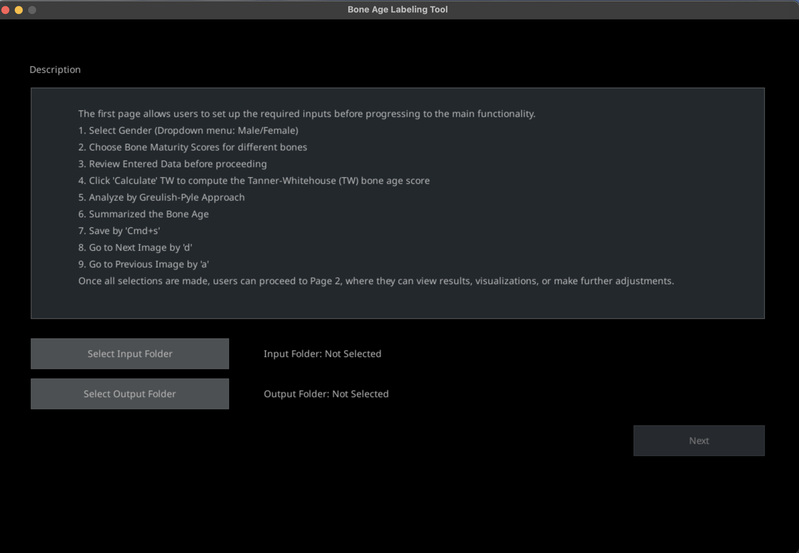
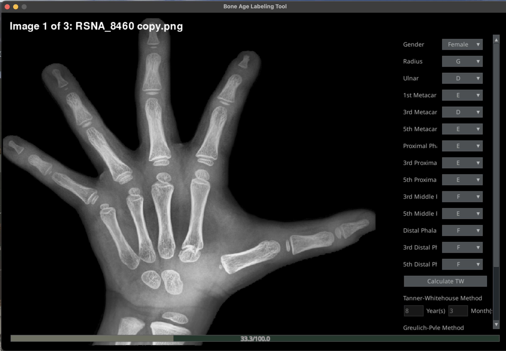

# BALT : Bone Age Labeling Tool
## Projects Description
This project, developed for the Studio 6 course in the Digital Media Engineering department at Khon Kaen University under the guidance of Asst. Prof. Witcha Feungchan, integrates innovative design and engineering principles. It focuses on creating a dynamic solution using Pygame to enhance efficiency and accuracy in digital media applications. This repository houses the complete source code, along with detailed documentation and examples to aid in understanding and replicating the project's functionality.

## Requirements
This project requires Python version 3.10.9 for proper installation and execution.
In addition users need to install these libraries by running command below

```bash
#Clone this git repository
git clone https://github.com/Khao0/BALT.git

# Navigate to the project directory
cd BALT

# Create environment for this project
python3 -m venv BALT 

# Activate environment
source BALT/bin/activate

# Install all requirements necessary module and dependencies for this project 
pip3 install -r requirements.txt
```
## Path to Dataset Directory


## Labeling
1. Select Gender (Dropdown menu: Male/Female)
2. Choose Bone Maturity Scores for different bones
3. Review Entered Data before proceeding
4. Click 'Calculate' TW to compute the Tanner-Whitehouse (TW) bone age score
5. Analyze by Greulish-Pyle Approach
6. Summarized the Bone Age
7. Save by 'Cmd+s'
8. Go to Next Image by 'd'
9. Go to Previous Image by 'a'

