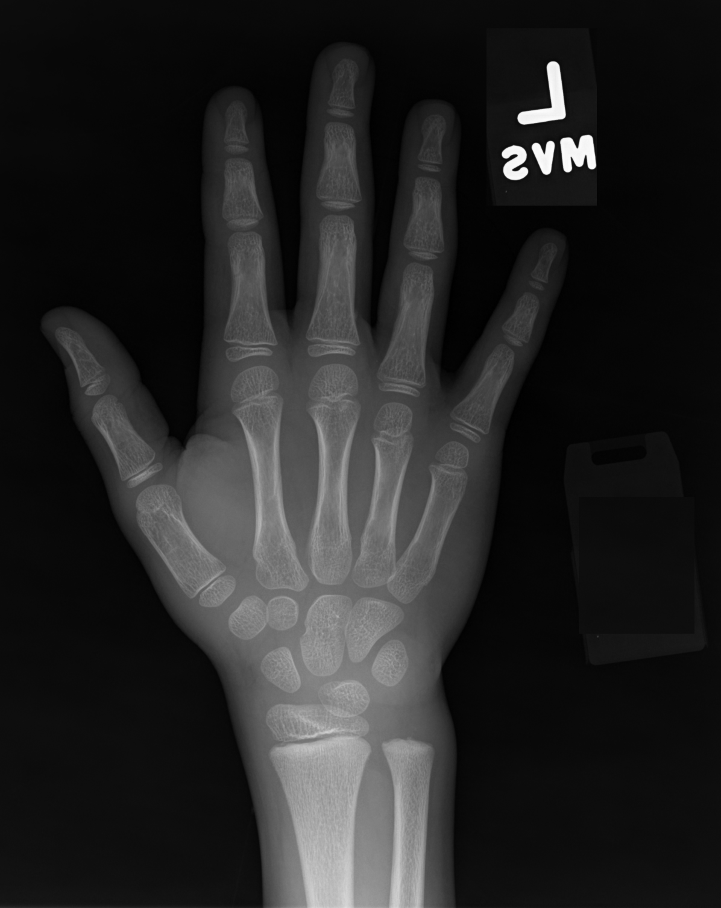
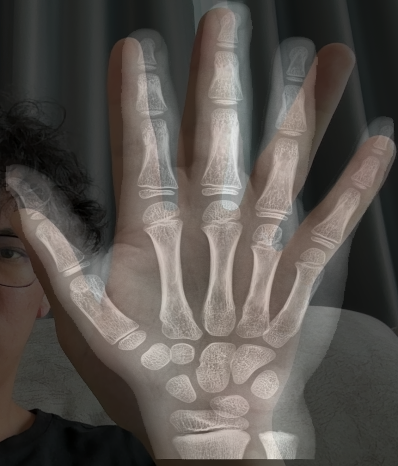
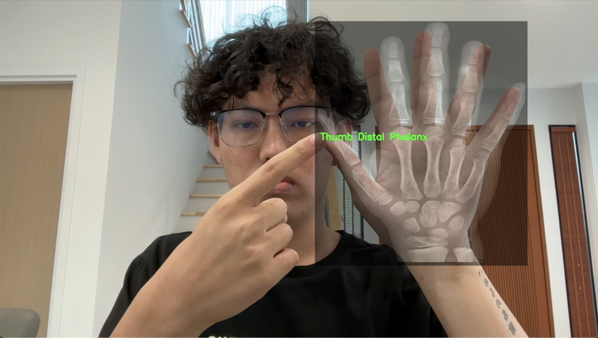
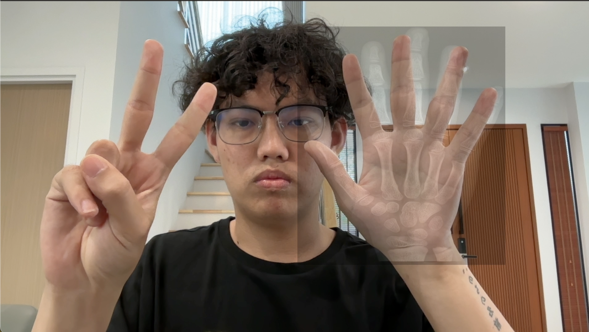
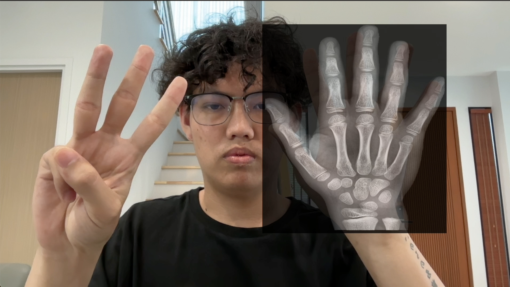

# X-ARay
## Projects Description
This project is part of the Extended Reality course in the Digital Media Engineering department at Khon Kaen University, Thailand, taught by Asst. Prof. Witcha Feungchan. It integrates X-ray imaging and AR with a multimodal deep learning model (with image processing pipeline such as CLAHE, Hand Segmentation etc.), aiming to overlay hand X-ray images onto a patient's hand. This approach could assist doctors in analyzing cases with limited resources, relying solely on hand X-ray images and running on a local device.

## Requirements
This project requires Python version 3.10.9 for proper installation and execution.
In addition users need to install these libraries by running command below
```bash
#Clone this git repository
git clone https://github.com/Khao0/X-ARay.git

# Navigate to the project directory
cd X-ARay

# Create environment for this project
python3 -m venv xaray 

# Activate environment
source xaray/bin/activate

# Install all requirements necessary module and dependencies for this project 
pip3 install -r requirements.txt
```
## Input
This project allows users to input their raw X-ray images by placing them into the `Input` folder. The project will automatically preprocess the images.  


## Features  

### Capture  
**Press `C` button**  
This feature allows users to capture only the Region of Interest (ROI), where the X-ray image is aligned with the hand. This enables users to analyze the captured image later.  


### 1-Finger Shortcut  
**Raise the left hand with the index finger extended**  
This feature allows users to point at the ROI region with their index finger, displaying the formal name of the bone.  


### 2-Finger Shortcut  
**Raise the left hand with the index and middle fingers extended**  
This feature decreases the opacity of the X-ray image, making it easier to analyze the ROI.  


### 3-Finger Shortcut  
**Raise the left hand with the index, middle, and ring fingers extended**  
This feature increases the opacity of the X-ray image, enhancing the visibility of the ROI.  



## Future Works  
- Due to the limited resources and time constraints, the X-ray image can currently overlay only the right hand. In the future, I plan to address this limitation.  
- When using the left hand to point at the right hand for displaying bone labels, the MediaPipe hand tracking model may become confused, leading to mistracking. This issue will be explored and improved in future iterations.  
